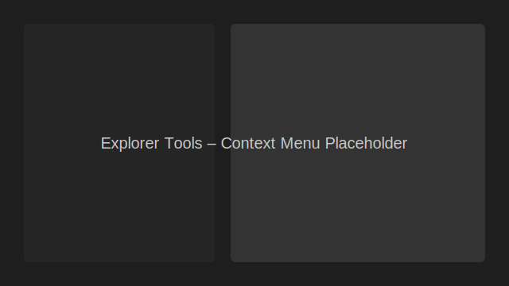

## Explorer Tools (VS Code Extension)

Context menu utilities for the VS Code Explorer. Adds three actions when you right-click any file or folder in the Explorer (left sidebar):

- Open in Finder/Explorer/File Manager
- Open Dedicated Terminal Here
- Open New VS Code Window Here

This extension is cross-platform (macOS, Windows, Linux) and handles files, folders, spaces in paths, symlinks, multi-root workspaces, and `vscode.Uri`.



### Features

- Open the selected item in your OS file manager
  - macOS: `open <path>` (Finder)
  - Windows: `explorer.exe <path>` (Explorer)
  - Linux: `xdg-open <path>` (File Manager)
- Open a dedicated terminal in the selected location
  - Always creates a new terminal
  - Terminal name: `Dedicated: <basename>`
  - Uses the folder of the file if a file was selected
- Open a new VS Code window focused on the selected directory
  - Uses the folder of the file if a file was selected

### How it works (ASCII diagram)

```
User right-clicks item in Explorer
           │
           ▼
     Explorer menu shows
           │
           ▼
  User picks one command
           │
           ▼
   Extension command runs
           │
           ├─ Open in File Manager → spawn platform command
           ├─ Open Dedicated Terminal → createTerminal({ cwd })
           └─ Open New VS Code Window → executeCommand('vscode.openFolder')
```

### Requirements

- VS Code 1.90.0+
- Linux only: `xdg-open` (from `xdg-utils`) must be available in `PATH` for the File Manager action.

### Getting Started (Development)

1. Install dependencies:
   ```bash
   npm install
   ```
2. Build in watch mode:
   ```bash
   npm run watch
   ```
3. Press F5 in VS Code to launch an Extension Development Host.

### Packaging

Create a VSIX package with:
```bash
npx vsce package
```

### Running Tests

This repo uses `vscode-test` with Mocha.

- Run all tests:
  ```bash
  npm test
  ```

### Troubleshooting

- Linux: If you see an error like "`xdg-open` not found", install `xdg-utils` with your package manager (e.g., `sudo apt install xdg-utils`).
- Remote windows/containers: Opening the system file manager may not be supported in remote contexts.

### Limitations

- The menu title is generic ("Open in Finder/Explorer/File Manager") for consistency across platforms.
- Opening a file with the File Manager action may launch its associated application instead of the file manager, depending on the OS.

### Commands

- Open in Finder/Explorer/File Manager: `explorerTools.openInFileManager`
- Open Dedicated Terminal Here: `explorerTools.openDedicatedTerminal`
- Open New VS Code Window Here: `explorerTools.openNewWindowHere`

### Acceptance Checklist

- [ ] Menus appear for file and folder
- [ ] macOS opens in Finder; Windows in Explorer; Linux via xdg-open
- [ ] Terminal opens with correct cwd and naming
- [ ] New VS Code window opens in the correct directory
- [ ] Paths with spaces work
- [ ] Works in multi-root workspaces
- [ ] Build, tests and package work (`npm run compile`, `npm test`, `npx vsce package`)

### License

MIT — see `LICENSE`.

